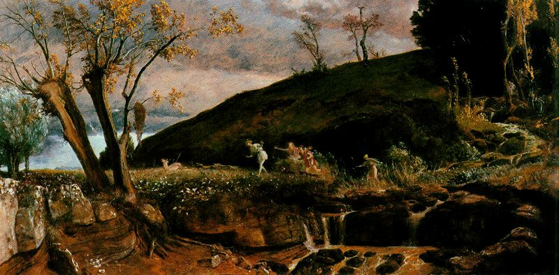

<!-- 

### About me
Software engineer and CS student based in the Netherlands, working on backend systems. 

Interested in distributed computing, deep learning (especially LLM inference & compression), and probability theory.

Also really like classical music, literature, and learning Mandarin.

  -->

### Current focus
- A paper on adversarial robustness of tabular foundation models.
-  **[Mippo](https://mippo.ai)** (SNS)

---

####  ~ Attending YCSUS
- Paris <- June 29
- San Francisco <- July 25-26